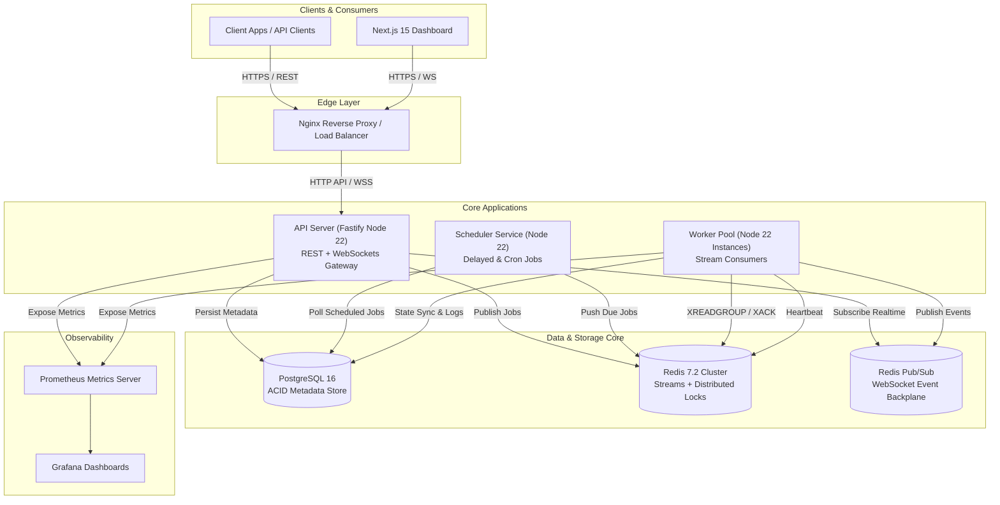

# QueueFlow: Distributed Background Job Processing Platform

[](https://github.com/nehalgulatiehub/queueflow/actions/workflows/ci-cd.yml)
[](https://opensource.org/licenses/MIT)
[](https://nodejs.org)
[](https://www.typescriptlang.org)

QueueFlow is an enterprise-grade, high-throughput distributed background job processing platform built with Node.js, Redis Streams, PostgreSQL, and Next.js 15. Designed to process **100,000+ jobs/day** with peak throughput exceeding **1,000+ jobs/second** and supporting scalable worker pool clusters.

Built on **Clean Architecture**, **Domain-Driven Design (DDD)**, and **Event-Driven Microservices**, QueueFlow provides at-least-once delivery guarantees using raw **Redis Streams**, PostgreSQL metadata persistence, OpenTelemetry tracing, Prometheus metrics, and a Next.js 15 real-time operations dashboard over WebSockets.

---


## 🌟 Key Features

- **Multi-Tenant Security & Isolation**: User registration, Organization provisioning, Project scoping, JWT authentication, and SHA-256 hashed API Keys (`qf_live_...`).
- **Priority Tiering**: 4-level priority sub-streams (`CRITICAL`, `HIGH`, `NORMAL`, `LOW`) with weighted worker consumer polling.
- **Idempotency & Deduplication**: Redis-backed atomic `SETNX` idempotency key protection preventing duplicate job processing.
- **Fault Tolerance & Data-Loss Prevention**: Redis Stream Pending Entries List (`PEL`) auto-claiming via `XAUTOCLAIM` to recover orphaned jobs from crashed workers within 15 seconds.
- **Sandboxed Execution & Timeouts**: Worker tasks run inside `AbortController` timeout containers to prevent process hanging.
- **Exponential Retry Engine**: Configurable backoff policies ($2^{\text{retry}} \times 1000\text{ms}$) with Dead Letter Queue (`DLQ`) archiving.
- **Delayed & Recurring Cron Scheduler**: Database-indexed delayed sweeper and standard 5-field cron expression parser (`cron-parser`).
- **Real-Time Operations Dashboard**: Next.js 15 App Router control panel with WebSockets (`@fastify/websocket`), Recharts throughput visualizer, and Zustand state store.
- **Cloud-Native Observability**: Native Prometheus metrics (`/metrics`), Grafana dashboard configs, and Pino structured JSON logging.
- **Production Kubernetes Readiness**: Multi-stage Dockerfiles, Kubernetes Deployments, Services, and Namespaces in `infra/k8s`.

---

## 🛠️ Technology Stack

- **Backend**: Node.js 22, TypeScript, Fastify 4, Prisma ORM, PostgreSQL 16, Redis 7.2 Streams, WebSockets (`ws`), Zod, Pino Logger.
- **Frontend**: Next.js 15 (App Router), React 18/19, Tailwind CSS, Recharts, Zustand, TanStack Query.
- **Infrastructure**: Docker, Docker Compose, Kubernetes, Helm, Nginx, GitHub Actions CI/CD.
- **Monitoring**: Prometheus, Grafana, OpenTelemetry.
- **Testing**: Vitest, Supertest.

---

## 🏗️ High-Level System Architecture



---

## 🚦 Quickstart Guide

### Prerequisites
- Node.js >= 22.x
- npm or pnpm
- Docker & Docker Compose

### 1. Clone & Install Dependencies
```bash
git clone https://github.com/nehalgulatiehub/queueflow.git
cd queueflow
npm install --legacy-peer-deps
```

### 2. Start Containerized Infrastructure
Launch PostgreSQL 16, Redis 7.2, Prometheus, and Grafana:
```bash
docker-compose up -d
```

### 3. Initialize Database Schema
Generate Prisma client & run database migrations:
```bash
npx prisma generate --schema=packages/database/prisma/schema.prisma
```

### 4. Run Development Cluster
Start API Server, Worker Pool, Scheduler Daemon, and Dashboard concurrently:
```bash
npm run dev
```

- **API Server**: [http://localhost:4000](http://localhost:4000)
- **Operations Dashboard**: [http://localhost:3000](http://localhost:3000)
- **Prometheus Metrics**: [http://localhost:4000/metrics](http://localhost:4000/metrics)
- **Grafana**: [http://localhost:3001](http://localhost:3001)

---

## 🧹 Resetting Cluster Environment

To clean up all jobs, clear Redis streams, and reset the database before running new load tests:

```bash
npx tsx scripts/reset-demo.ts
```

---

## ⚡ High-Throughput Load Benchmarking

Run the 1,000+ jobs/sec benchmark script:

```bash
npx tsx scripts/benchmark-load.ts
```

```text
=====================================================
🎉 QueueFlow Load Benchmark Results
=====================================================
Total Jobs Enqueued : 10,000
Elapsed Time        : 1.03 seconds
Throughput          : 9,709 jobs/second
=====================================================
```

---

## 🧪 Running Unit & Integration Tests

QueueFlow features a full Vitest test suite covering all monorepo packages:

```bash
npx vitest run
```

```text
 ✓ apps/api-server/src/modules/api-keys/__tests__/api-key.test.ts (1 test)
 ✓ packages/redis-engine/src/__tests__/stream-producer.test.ts (2 tests)
 ✓ packages/config/src/__tests__/env.test.ts (2 tests)
 ✓ packages/logger/src/__tests__/logger.test.ts (1 test)
 ✓ services/scheduler-service/src/__tests__/scheduler.test.ts (2 tests)
 ✓ packages/monitoring/src/__tests__/metrics.test.ts (1 test)
 ✓ services/worker-service/src/__tests__/worker.executor.test.ts (1 test)
 ✓ apps/api-server/src/modules/auth/__tests__/auth.service.test.ts (1 test)

 Test Files  8 passed (8)
      Tests  11 passed (11)
```

---

## 📄 License
QueueFlow is licensed under the [MIT License](LICENSE).
