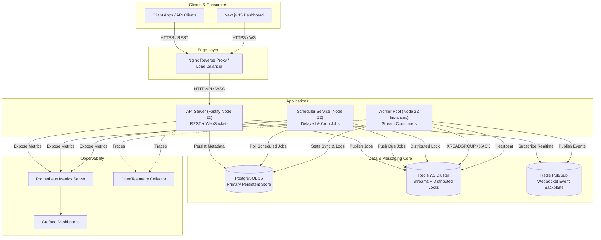
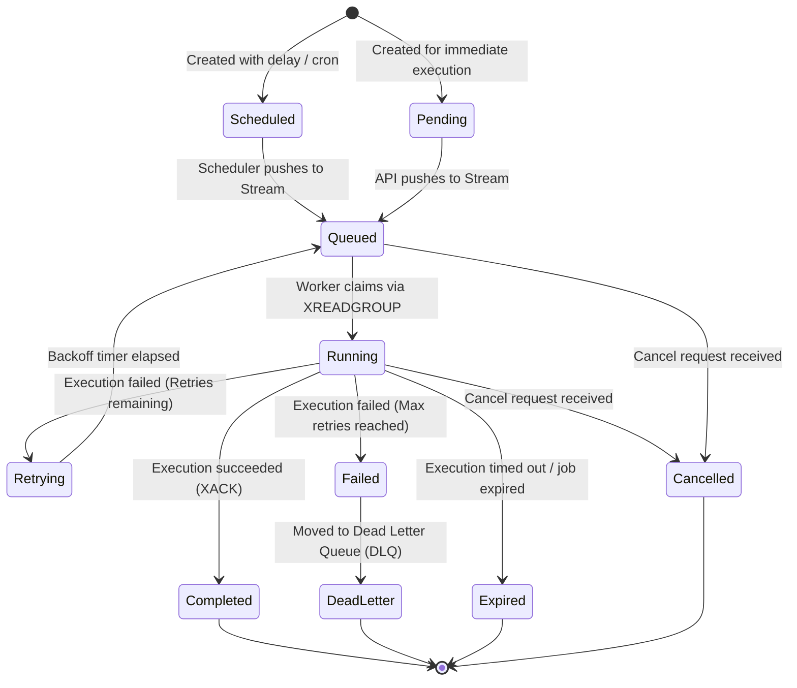

# QueueFlow: Distributed Background Job Processing Platform
## System Architecture & Technical Specification (Phase 1)

---

### Executive Summary & System Requirements

QueueFlow is a enterprise-grade, high-throughput, distributed background job processing platform designed to process **100,000+ jobs/day** with peak loads exceeding **1,000 jobs/second**, supporting up to **1,000 active worker instances** with sub-50ms queue ingestion latency.

#### Architectural Principles:
1. **At-Least-Once Delivery**: No job loss guaranteed through Redis Streams Consumer Groups, explicit ACKs (`XACK`), and Pending Entry List (`PEL`) reclamation (`XAUTOCLAIM`).
2. **Clean Architecture & DDD**: Strict separation of concerns across Domain, Application, Infrastructure, and Interface layers.
3. **Decoupled Event-Driven Core**: Pub/Sub backplane (Redis) for real-time WebSocket state propagation and decoupling producers from consumer workers.
4. **Idempotency & Deduplication**: Redis-backed distributed locks and deduplication tokens preventing duplicate execution under network partitions.
5. **High Observability**: Native OpenTelemetry instrumentation, Prometheus metrics export, and structured Pino JSON logging with distributed correlation tracking (`trace_id`, `job_id`, `worker_id`).

---

### 1. High-Level Architecture

---

### 2. Service Responsibilities & Boundary Definition

| Service | Primary Responsibility | Key Components | Storage Interactions |
| :--- | :--- | :--- | :--- |
| **API Server** | Ingestion, REST APIs, Auth, Real-time WebSockets, Queue Management | Fastify, Zod schemas, JWT Auth, WebSocket Gateway, Rate Limiter | Reads/Writes Postgres, Produces to Redis Streams, Listens to Redis PubSub |
| **Worker Service** | High-concurrency job execution, sandboxing, heartbeats, status reports | Stream Consumer (`XREADGROUP`), Lock Manager, Heartbeat Loop, Graceful Shutdown Handler | Consumes Redis Streams (`XACK`/`XCLAIM`), Writes Logs & Status to Postgres |
| **Scheduler Service** | Delayed job evaluation, Cron/Recurring expression triggers, Retry timers | Cron Evaluator, Due-Job Sweeper, Expiration Cleaner | Queries index on Postgres `jobs(scheduledAt, status)`, Pushes to Redis Streams |
| **Dashboard App** | Operations visualization, live queue administration, metrics analytics | Next.js 15 App Router, TanStack Query, Zustand, Recharts, WSS Client | Consumes API Server REST & WebSocket stream |

---

### 3. Data Flow & Job State Lifecycle

#### Job State Diagram

---

### 4. Failure Recovery & Resiliency Matrix

| Failure Scenario | Mitigation Mechanism | Guarantee |
| :--- | :--- | :--- |
| **Worker process crashes mid-execution** | Worker heartbeat expires in Redis. Scheduler/Worker auto-claim monitor detects idle job in Redis Stream PEL via `XAUTOCLAIM` (idle > 30s) and reassigns to an active worker. | At-least-once processing |
| **Duplicate payload submission** | Client provides `idempotencyKey`. API performs atomic Redis set `SETNX idempotency:{key} {job_id} EX 86400`. Returns existing `job_id` on match. | Exactly-once ingestion |
| **Database temporary disconnection** | Worker buffer logs in memory up to limit, Redis stream keeps job state transiently; retries DB status write with exponential backoff before throwing. | Transient fault isolation |
| **Slow / Hanging job execution** | Worker runs execution inside `AbortController` timeout wrapper. If `timeoutMs` exceeded, process aborts job, logs `TIMEOUT`, and decrements retry count. | Resource leakage protection |
| **Poison Pill Job (infinite crash loop)** | Configurable `maxRetries`. On failure threshold, job moves to `dead_letter_jobs` table and `XACK` is sent to clean stream. | System stability |

---

### 5. Architectural Trade-offs & Tech Stack Rationale

1. **Why Node.js 22 + Fastify instead of Express or NestJS?**
   - *Rationale*: Fastify provides up to **2x-3x higher throughput** than Express with lower overhead per request. Node.js 22 brings native WebSocket support improvements, improved V8 performance, and built-in test runner capabilities. Fastify's schema-based validation (via JSON Schema/Zod) compiles down to extremely fast serializers (`fast-json-stringify`).

2. **Why Redis Streams instead of BullMQ abstraction or RabbitMQ/Kafka?**
   - *Rationale*: Building on raw Redis Streams demonstrates true core engineering mastery over stream data structures (`XADD`, `XREADGROUP`, `XACK`, `XAUTOCLAIM`, `XPENDING`). Unlike RabbitMQ or Kafka, Redis Streams offer extremely low latency (< 1ms) with low operational footprint, perfect for sub-second background job routing, while providing native consumer group consumer offset tracking.

3. **Why PostgreSQL + Prisma ORM for Metadata?**
   - *Rationale*: Jobs require ACID guarantees for auditing, complex queries (filtering by tags, orgs, projects, date ranges), historical metrics, and dead-letter analysis. Prisma provides full type-safety from schema to application code. Critical query paths rely on targeted compound indexes.

---
