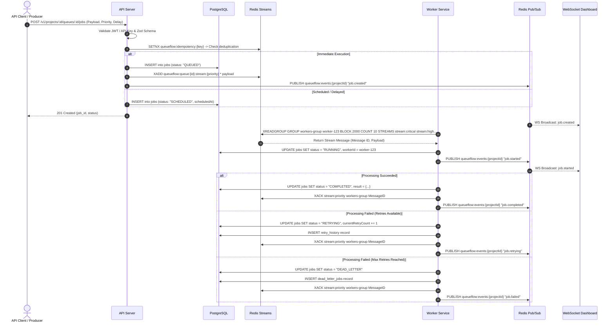

# QueueFlow: Data Flow & Redis Streams Architecture Design

---

### 1. Redis Key Space & Stream Topology

To support isolated multi-tenancy, rate limits, and multi-priority queues, keys in Redis follow a structured naming pattern:

```text
queueflow:queue:{queue_id}:stream:{priority}    -> Stream Key (Hash Ring/Streams)
queueflow:queue:{queue_id}:consumer_group        -> Consumer Group Name: "workers-group"
queueflow:lock:job:{job_id}                     -> Execution Lock (Redlock / SET NX PX)
queueflow:idempotency:{projectId}:{key}          -> Ingestion Idempotency Key (SET NX EX)
queueflow:worker:{worker_id}:heartbeat          -> Worker Pulse Key (TTL 30s)
queueflow:events:{project_id}                    -> Pub/Sub Channel for WebSockets
```

#### Priority Tiering Architecture
QueueFlow handles 4 priority levels per queue:
1. `CRITICAL` (Weight: 8)
2. `HIGH` (Weight: 4)
3. `NORMAL` (Weight: 2)
4. `LOW` (Weight: 1)

Workers implement a **Weighted Priority Poller** using `XREADGROUP` sequentially across priority streams for a given queue, ensuring critical jobs are claimed immediately while preventing starvation of lower-tier jobs.

---

### 2. End-to-End Ingestion & Consumption Sequence Diagram



---

### 3. Recovering Stuck & Orphaned Jobs (PEL Reclamation)

When a worker process crashes or loses network connectivity mid-job, the message remains in the **Pending Entries List (PEL)** of Redis Streams.

#### Recovery Routine (`XAUTOCLAIM` Engine):
1. **Sweeper Schedule**: Runs every 15 seconds in the Worker background pool or Scheduler service.
2. **Execution Command**:
   ```redis
   XAUTOCLAIM queueflow:queue:{queue_id}:stream:{priority} workers-group worker-recovery-instance 30000 0-0 COUNT 50
   ```
   - `30000` = Minimum idle time in milliseconds (30 seconds without XACK or activity).
   - If returned count > 0, claimed messages are reassigned to `worker-recovery-instance`.
3. **Database Audit**: If retry limit exceeded during PEL claim, item is converted to `DEAD_LETTER` state in PostgreSQL.

---

### 4. Distributed Lock & Concurrency Control

To guarantee that a single job cannot be executed concurrently by multiple workers during recovery windows:

```typescript
// Pseudocode for Redlock/SETNX execution guard
async function acquireJobLock(jobId: string, workerId: string, ttlMs: number): Promise<boolean> {
  const lockKey = `queueflow:lock:job:${jobId}`;
  const acquired = await redis.set(lockKey, workerId, 'PX', ttlMs, 'NX');
  return acquired === 'OK';
}
```
- Heartbeat loop extends lock TTL periodically while job status is `RUNNING`.
- On job finish (`COMPLETED` / `FAILED`), lock is released via atomic Lua script checking `GET lockKey === workerId`.

---
